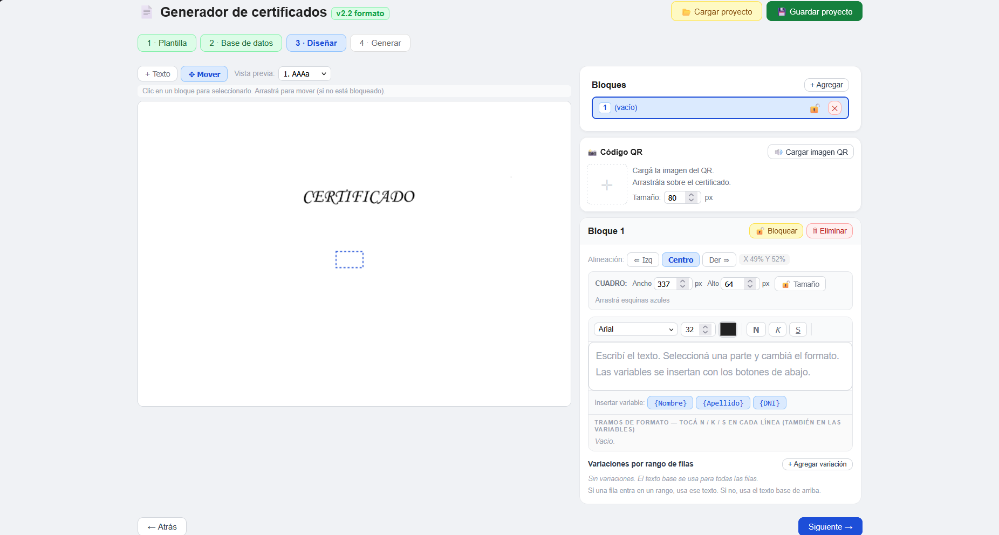
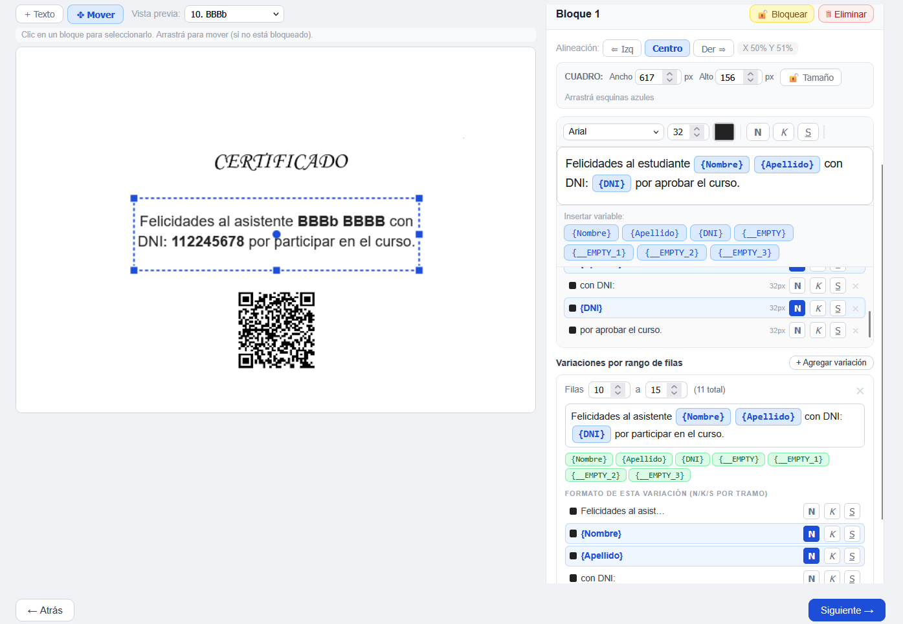
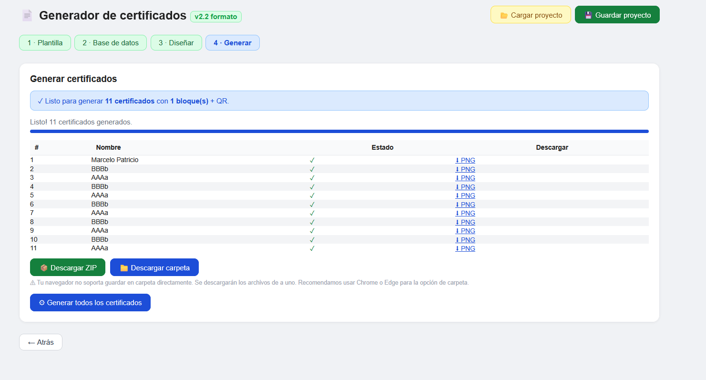
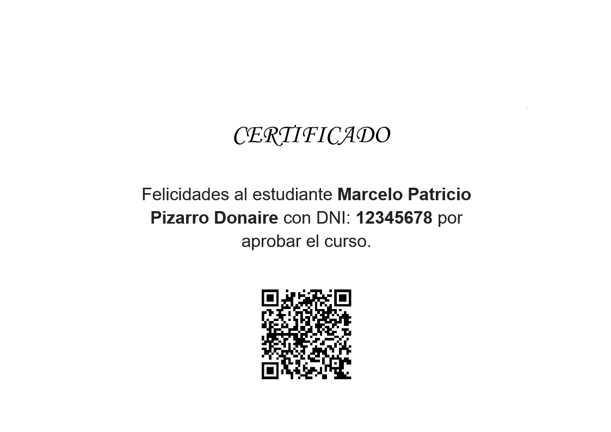

# Generador de Certificados

**Generación masiva de certificados digitales personalizados.** A partir de una plantilla
gráfica y una planilla Excel, produce automáticamente todos los certificados de un evento
—cada uno con los datos de su destinatario— y los exporta como imágenes listas para enviar.

Desarrollado para la **Facultad de Ciencias de la Salud, Universidad Nacional de Salta (UNSa)**,
donde está en uso para la emisión de certificados de cursos y jornadas.

> **Software comercial.** El código fuente no es público. Licenciamiento para
> instituciones — ver [Cómo obtenerlo](#-cómo-obtenerlo).

---

## Verlo funcionando

### ▶️ Video de demostración

<!-- ═══════════════════════════════════════════════════════════════
     COMO INCRUSTAR EL VIDEO (para que se reproduzca acá, sin descarga):
       1. Abrí este README en github.com y tocá el lápiz (Edit).
       2. Arrastrá el archivo del video dentro del cuadro de edición
          (o usá "paste, drop, or click to add files" abajo del editor).
       3. GitHub lo sube y deja sola una línea como:
              https://github.com/user-attachments/assets/xxxxxxxx-....
          Dejá esa línea acá, justo debajo de este comentario.
       4. Commit changes. El reproductor aparece automáticamente.
     ═══════════════════════════════════════════════════════════════ -->

_🎥 Video de demostración disponible a pedido — o se incrusta acá siguiendo los pasos de arriba._

### Capturas

| | |
|---|---|
| **Editor visual** |  |
| **Variables y formato** |  |
| **Generación masiva** |  |
| **Certificado final** |  |

_Las capturas usan datos ficticios._

---

## Qué resuelve

Emitir 200 certificados a mano es una tarde entera de copiar, pegar y exportar, con el
riesgo de equivocar un nombre o un DNI. Esta herramienta lo reduce a **cargar dos archivos
y apretar un botón**.

- Sin instalación, sin servidor y **sin conexión a internet**: es una sola página que se
  abre en el navegador. Los datos de las personas **nunca salen de la computadora**.
- Diseño visual: se arma el certificado arrastrando bloques sobre la plantilla real.
- El texto se adapta solo al ancho del cuadro, respetando negritas y tamaños mixtos.

---

## Funcionalidades

**Editor visual**
- Bloques de texto arrastrables y redimensionables desde las esquinas
- Edición directa sobre el certificado (doble clic) o desde el panel lateral
- Candados independientes de posición y de tamaño
- Alineación por bloque y medidas exactas en píxeles

**Texto y variables**
- Variables tomadas del Excel (`{Nombre}`, `{DNI}`, `{Cargo}`…) insertadas como etiquetas
- Formato independiente por tramo: fuente, tamaño, color, negrita, cursiva y subrayado
- Cada variable se formatea por separado con un clic
- Ajuste de línea que mide cada palabra con su propia tipografía

**Variaciones por rango de filas**
- Un mismo bloque puede tener textos y formatos distintos según la fila
- Ejemplo: filas 1 a 10 con un texto para *Disertantes* y 11 en adelante para *Asistentes*

**Base de datos**
- Carga desde Excel (`.xlsx`), con la primera fila como nombres de columna
- Tabla editable dentro de la app y exportable con los cambios

**Generación y entrega**
- Renderizado en la resolución real de la plantilla
- Exportación a PNG individuales, en ZIP o directamente a una carpeta del sistema
- Guardado del proyecto completo (plantilla + datos + diseño) para retomarlo después
- Código QR posicionable para verificación

---

## Cómo funciona

```
1 · Plantilla      Se carga la imagen de fondo del certificado
2 · Base de datos  Se carga el Excel: una fila por persona
3 · Diseño         Se ubican los textos y las variables sobre la plantilla
4 · Generación     Se generan y descargan todos los certificados
```

---

## Tecnología

| Capa | Tecnología |
|---|---|
| Lenguaje | JavaScript (ES6+), HTML5, CSS3 — sin frameworks |
| Renderizado | Canvas API 2D |
| Lectura de Excel | SheetJS |
| Empaquetado ZIP | JSZip |
| Guardado en carpeta | File System Access API |
| Arquitectura | Single-file, 100 % del lado del cliente |

Todo el procesamiento ocurre en el navegador del usuario: no hay backend que reciba datos
personales, lo que simplifica el cumplimiento en instituciones públicas.

---

## Cómo obtenerlo

El producto se licencia a instituciones bajo **suscripción**. La licencia incluye
activación, actualizaciones y soporte.

Si tu institución necesita emitir certificados en volumen, escribime y coordinamos una
**demostración en vivo**.

**marcelop.pizarro.d@gmail.com**
[github.com/Marce-98](https://github.com/Marce-98)

---

## Sobre este repositorio

Este repositorio es una **vitrina**: contiene documentación, capturas y video del producto.
El código fuente se mantiene en un repositorio privado y **no se distribuye** salvo bajo
licencia.

Las capturas usan **datos ficticios**; no se muestran datos personales reales.

---

© Marcelo Pizarro — Salta, Argentina. Todos los derechos reservados.
